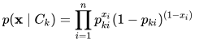

# Bernoulli Naive Bayes Classifier

* A feature vector in the Bernoulli naive Bayes classifier is a boolean variable, expressing the ::occurrence or absence:: of an event _i_.
* In the context of document classification, this represents whether if the _i_th term vocabulary is present.
* Bernoulli event model is popular for classifying ::short texts::.
* `Pr(x_j | C_k)` is the Bernoulli distribution PDF, shown below.

