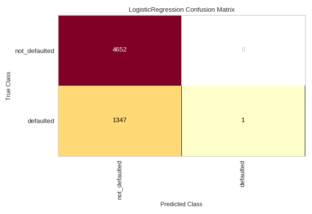

# Confusion Matrix

* A confusion matrix is a threshold-dependent heatmap metric. The x-axis shows the ground truth while the y-axis shows the predictions.
* A variety of classification metrics can be derived from this matrix.
* ::Precision::, defined as `TP / (TP + FN)`, is the percentage of positive classes that the model correctly predicted out of all classes that are **actually positive**.
    * a.k.a. sensitivity, true positive rate (TPR).
* ::Precision::, defined as `TP / (TP + FP)`, is the percentage of positive classes that the model correctly predicted out of all the **positive predictions**.
* ::False positive rate (FPR)::, defined as `FP / (TN + FP)`, is the percentage of positive classes that the model incorrectly predicted out of all classes that are **actually negative**.
* ::F1 score::, defined as `2*(Recall x Precision) / (Recall + Precision)`, is the harmonic mean of precision and recall.
* ::Accuracy::, defined as `(TP + TN) / (TP + TN + FP + FN)`, is a seldom used metric in classification due to the **accuracy paradox**.

