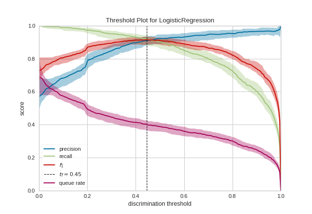

# Discrimination Threshold

* Since metrics derived from the confusion matrix is threshold-dependent, the discrimination threshold plot shows how these metrics change with different thresholds.
* This is a way to visually determine the ::best threshold:: in the context of the problem.

