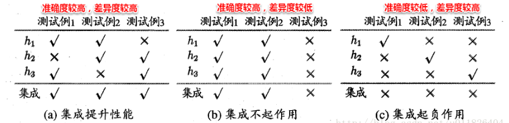

# Ensemble Learning (集成学习)

* [[Max Voting (多数投票法)]]
* [[Averaging (平均法)]]
* [[Stacking]]
* [[Boosting]]
* [[Bagging]]

----

### Context

* Ensemble methods are meta-algorithms that combine several machine learning techniques into one predictive model in order to **decrease** **variance** (bagging), **bias** (boosting), or **improve predictions** (stacking).
* ::Sequential ensemble:: method: base learners are generated sequentially to exploit the dependence between these learners. This method improves performance by giving higher weight to previously mislabeled examples (e.g. AdaBoost.)
* ::Parallel ensemble:: method: base learners are generated in parallel to exploit the independence between these learners since errors can be reduced dramatically by averaging (e.g. random forest.)
* 如果所有的单个学习器都是同类的，例如都是决策树，或者都是神经网络，那么这个集成就叫做同质（::Homogeneous::）；反之，如果既有决策树又有神经网络，那么集成就叫做异质（::heterogeneous::）的。

