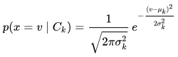

# Gaussian Naive Bayes Classifier

* Gaussian naive Bayes Classifier deals with features that are continuous. We segment the data by the class, and calculate the mean and variance of `x` for each class.
* `Pr(x_j | C_k)` is the Gaussian distribution PDF, shown below.
* Another common way of handling continuous features is to use ::binning to discretize:: the features to obtain a new set of Bernoulli-distributed features.

