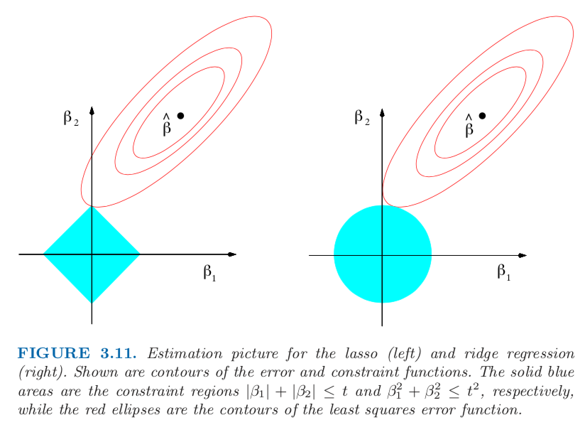

# L1 and L2 Regularization

* The red contours represent the residual sum of squares function. The minimum of the function lies at the center of the contour. This corresponds to the minimum of regular linear regression.
* The blue areas represent the L1 constraint  `∑|ß_j| ≤ t` and the L2 constraint `∑ß_j^2 ≤ t^2` from left to right. Here `p=2` for plotting convenience.
* The y-axis represent the value of the learned coefficient `ß_2` and the x-axis represent the value of the learned coefficient `ß_1`.
* Since we're trying to minimize the SSR while under the constraint of regularization, the only possible minimum that achieves this is where the contour intersects with the blue area.
* For L1 regularization, the intersection occurs where `ß_2=t` and `ß_1=0`. This explains why L1 regularization leads to coefficients with zero as their value. (Note: this also applies to higher dimensions.)
* For L2 regularization, the intersection occurs where `ß_2≈t` and `ß_1≈0`. This explains why L2 regularization have coefficients whose value infinitesimally approach zero but never equals zero.

----

### Resources

* [Linear regression (6): Regularization](https://www.youtube.com/watch?v=sO4ZirJh9ds)

