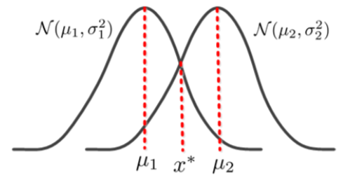
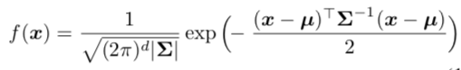
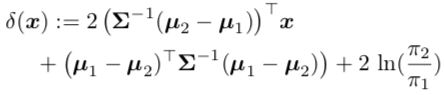
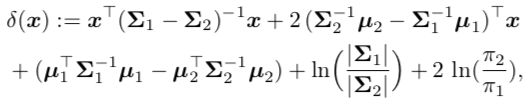
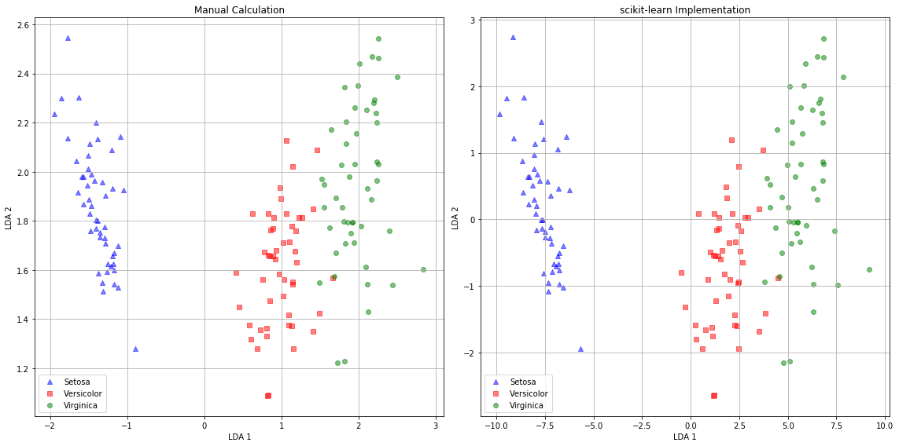

# Linear Discriminant Analysis

* Linear discriminant analysis (LDA) is a dimensionality reduction technique that projects a feature space in `ℝ^P` onto a lower dimensional subspace `ℝ^Q`, where `Q≤P-1` with ::good class-separability:: in order to avoid overfitting ("curse of dimensionality") and also reduce computational costs.
    * LDA is ::not an unsupervised:: machine learning algorithm.
* Algorithm:
    1. Calculate the class centroid matrix `M ∈ ℝ^{KxP}`, where
        * `K` is the number of classes.
        * Each row represents the subset of class `k`.
        * Each column represents a feature in the feature space `ℝ^P`.
    3. Calculate the within-class scatter matrix `W ∈ ℝ^{PxP} = (c=k to K)(x ∈ C_k)∑∑[(x - m_i)(x - m_i)T]`, where
        * `C_k` represents the subset of class `k`.
        * `m_i = (1/N_k)*(x ∈ C_k)∑x`, where `N_k` is the number of elements in class `k`.
        * The inner sum is equivalent to the sum of the covariance matrix of `x_k` without the divisor `N - 1`.
    3. Calculate the between-class scatter matrix `B ∈ ℝ^{PxP} = (i=p to P)∑[N_i * (m_i - mbar)(m_i - mbar)T]`, where
        * `m_i` is the _i_th column of `M`, i.e., the mean value of feature `i` for each class.
        * `mbar` is the mean value of feature `i` for all classes.
    5. Use eigen decomposition to find the eigenvalues `Λ` and eigenvectors `V` of the matrix `W-1B`.
    6. Select the `q` best eigenvectors based on the magnitude of the eigenvalues, i.e.,
        * If all the eigenvectors have ::similar magnitude::, this might be a good indicator that our data is already projected on a "good" feature space.
        * If some eigenvalues are ::much larger than others::, we might be interested in only keeping their corresponding eigenvectors, as they contain more information.
    6. Project the data matrix `X` onto the lower subspace `ℝ^Q` via `X_q = XV_q`, where `V_q` are the top `q` eigenvectors sorted by column.
* Assumptions:
    * ::Normally:: distributed data.
    * Features are ::independent::.
    * ::Identical covariance:: for each class.
    * Discriminatory information lies in the mean of the classes not the variance.
    * Similar number of observations in each class.


----

### Classification

* Suppose that we have two classes `C_1` and `C_2`, and a single feature `X`, where `X` follows a Gaussian distribution, i.e.,
    * `X~N(μ_1, σ^2_1)` if `x ∈ C_1` else `X~N(μ_2, σ^2_2)`.
    * `μ_1 < μ_2`.
* At a point `x*`, the probability of the two classes are equal; therefore the point `x*` is on the boundary of the two classes.
    * As shown in the figure below, `μ_1 < x* < μ_2`.
* A classification rule based on this would be:
    * `yhat = C_1` if `x < x*` else `yhat = C_2`.
    * And the corresponding classification error is `P(error) = P(x>x* |
      x∈C_1)P(x∈C_1) + P(x<x* | x∈C_2)P(x∈C_2)`.
    * To minimize the error, we solve for the following equation `(x*)argmin(P(error)) = ∂P(error)/∂x* = 0`.
* The result above gives us the following: ::(A):: `f_1(x)π_1 - f_2(x)π_2 = 0`, where
    * `f_k(x)` is the PDF of `X` in the subset of class `k`.
    * `π_k` is the prior of class `k`.
* In the case where `X ∈ ℝ^p`, we use the PDF for the multivariate Gaussian distribution, shown in the figure below, where
    * `μ ∈ ℝ^p` is the mean, `∑ ∈ ℝ^{dxd}` is the covariance matrix.
* In LDA, we assume that the ::classes have equal covariance matrices::, i.e., `∑_1 = ∑_2 = ∑`.
* Plugging in these information for `f_1(x)` and `f_2(x)` into (A) gives `δ(x)`, shown in the figure below.
    * This is a ::linear equation:: in `X`.
* Thus, the ::classification rule:: that minimizes the error is:
    * `Chat(x) = C_1` if `δ(x) < 0` else `Chat(x) = C_2`.
    * And the decision boundary is linear.







----

### Quadratic Discriminant Analysis

* In the quadratic case, the ::class covariance matrices are not assumed to be equal::, i.e., `∑_1 ≠ ∑_2`.
* Thus, equation ::(A):: is quadratic in `X`, shown in the figure below.
* The classification rule for `δ(x)` remains the same.
* In this case, the decision boundary is quadratic.



----

### Regularized Discriminant Analysis

* Regularized discriminant analysis allows one to ::shrink the separate covariances of QDA towards a common covariance in LDA::.
    * `∑_k(α) = α∑_k + (1 - α)∑_k`, where `α ∈ [0, 1]`.
* This allows for a continuum of models between LDA and QDA.

----

### Parameter Estimation

* `π_k ≈ n_k / n` where `n` is the number of observations.
* `μ_k ≈ (1 / n_k) * (i=1 to n)∑[x_i * I(C(x_i) ∈ k)]`.
* `∑_k ≈ (1 / (n_k - 1)) * (i=1 to n)∑[(x_i - μ_k)(x_i - μ_k)T * I(C(x_i) ∈ k)]`.

----

### Code Example

```python
import numpy as np
import pandas as pd
from sklearn.datasets import load_iris
from sklearn.discriminant_analysis import LinearDiscriminantAnalysis

# Load data
data = load_iris()
data = pd.concat([
    pd.DataFrame(data.data, columns=data.feature_names),
    pd.DataFrame({"y": data.target})
], axis=1)

# 1. Calculate mean matrix
M = data.groupby("y", as_index=False).mean().drop("y", axis=1).T

# 2. Calculate within-class scatter matrix
W = np.zeros([data.shape[1]-1, data.shape[1]-1])
for k in data["y"].unique():
    subset = data[data["y"]==k].drop("y", axis=1)
    n = len(subset)
    W += np.cov(subset, rowvar=False) * (n - 1)

# 3. Calculate the between-class scatter matrix
m = np.mean(data.drop("y", axis=1), axis=0).values.reshape(-1, 1)
B = np.zeros([data.shape[1]-1, data.shape[1]-1])

for c in M.columns:
    class_mean = M[c].values.reshape(-1, 1)
    n = len(data[data["y"]==c])
    B += n * (class_mean - m).dot((class_mean - m).T)

# 4. Find eigenvalues and eigenvectors of W-1B
eig_vals, eig_vecs = np.linalg.eig(np.dot(np.linalg.inv(W), B))

# 5. Transform X and flip signs
n_components = min(data.shape[1] - 2, data["y"].nunique() - 1)
X_eig = -np.dot(data.drop("y", axis=1), eig_vecs[:,:n_components])

# scikit-learn implementation
lda = LinearDiscriminantAnalysis(n_components=n_components)
X_lda = lda.fit_transform(data.drop("y", axis=1), data["y"])

# Plot comparison
label_dict = {0: "Setosa", 1: "Versicolor", 2: "Virginica"}
f, (ax1, ax2) = plt.subplots(1, 2, figsize=(16, 8))
for label, marker, color in zip(
    data["y"].unique(), ("^", "s", "o"), ("blue", "red", "green")
):
    ax1.scatter(x=X_eig[:,0][data["y"] == label],
                y=X_eig[:,1][data["y"] == label],
                marker=marker,
                color=color,
                alpha=0.5,
                label=label_dict[label])
    ax2.scatter(x=X_lda[:,0][data["y"] == label],
                y=X_lda[:,1][data["y"] == label],
                marker=marker,
                color=color,
                alpha=0.5,
                label=label_dict[label])
ax1.set_title("Manual Calculation")
ax1.set_xlabel("LDA 1"); ax1.set_ylabel("LDA 2")
ax1.grid(); ax1.legend()
ax2.set_title("scikit-learn Implementation")
ax2.set_xlabel("LDA 1"); ax2.set_ylabel("LDA 2")
ax2.grid(); ax2.legend()
plt.tight_layout()
plt.show()
```


----

### Resources

* [Linear Discriminant Analysis](https://sebastianraschka.com/Articles/2014_python_lda.html)
* [Linear and Quadratic Discriminant Analysis: Tutorial](https://arxiv.org/pdf/1906.02590.pdf)

