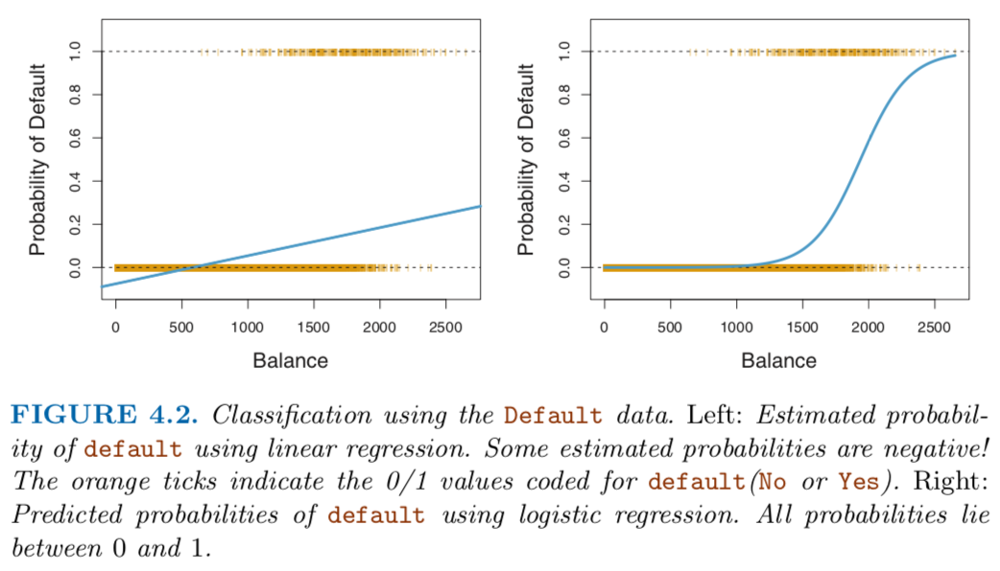

# Logistic Regression

* [[Sigmoid Function]]
* [[Odds and Logit]]
* [[Odds Ratio and Log Odds Ratio]]
* [[Maximum Likelihood Estimation]]

----

### Context

* Given a binary response, modeling the probability of each class using a linear equation `P(Y=k|X) = ß_0 + ß_1X` will lead to predictions outside the range of `[0, 1]`.
* However, if we transform the entire right hand side using the logistic function, our output will also be bounded within `[0, 1]`, i.e.,
    * `P(Y=k|X) = exp(ß_0 + ß_1X) / [1 + exp(ß_0 + ß_1X)]`.
* If we rearrange the equation, and take the logarithm on both sides,
    * `P(Y=k|X) / [1 - P(Y=k|X)] = exp(ß_0 + ß_1X)`.
    * `log[P(Y=k|X) / [1 - P(Y=k|X)]] = ß_0 + ß_1X`.
* We get a linear equation in `X` that models the log odds or logit, which can be solved using maximum likelihood estimation.

----

### Resources

* <a href='PDFs/mlelr.pdf'>mlelr.pdf</a>
* <a href='PDFs/ch12.pdf'>ch12.pdf</a>
