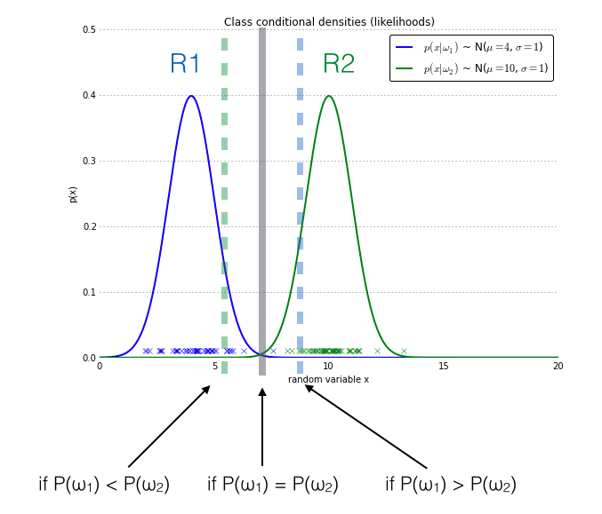

# Naive Bayes Classifier

* [[Bayes' Theorem]]
* [[Multinomial Naive Bayes Classifier]]
* [[Bernoulli Naive Bayes Classifier]]
* [[Gaussian Naive Bayes Classifier]]

----

### Context   

* When defined in terms of priori, evidence, conditional probability, and posterior, Bayes' theorem can be stated as `Pr(x∈C_k|X=x) = [Pr(X=x|x∈C_k) * Pr(x∈C_k)] / Pr(X=x)`, where
    * `Pr(x∈C_k)` is the priori.
    * `Pr(X=x | x∈C_k)` is the conditional probability or likelihood.
    * `Pr(X=x) = (k=1 to K)∑[Pr(X=x|x∈C_k) * Pr(C_k)]` is the evidence.
    * `Pr(x∈C_k | X=x)` is the posterior.
* The goal of the naive Bayes classifier is to maximize the posterior probability, a.k.a ::maximum a posterior probability (MAP)::, for a given class `k`, and hence it is a type of ::generative model::.
    * `Chat(x) = (k)argmax[Pr(X=x|x∈C_k) * Pr(x∈C_k)]`, the denominator, i.e., the evidence, is omitted because it is the same for each class and is thus irrelevant to the maximization.
* Because of the independence assumption, the conditional probability can be simplified to a product, i.e,
    * `Chat(x) = (k)argmax[Pr(x∈C_k) * (j=1 to p)∏(Pr(x_j | C_k))]`.
* `Pr(x_j | C_k)` is the ::PDF of the assumed distribution of the feature::, a.k.a the **event model** of the naive Bayes classifier,  `x_j`. Commonly used event models are:
    * Multinomial
    * Bernoulli
    * Gaussian

----

### Additive Smoothing

* If an unseen observation in a feature was presented during prediction time, the class-conditional probability for that observation would be 0, and hence, the posterior probability will also be 0.
* To prevent this problem of zero probabilities, an additive smoothing term called ::pseudocount:: is added for the multinomial naive Bayes classifier.
    * Laplace smoothing is when the pseudocount is 1.
    * Lidstone smoothing is the general case.

----

### Assumptions and Limitations

* The adjective "naive" comes from the assumption that the features in a data set are ::mutually independent::.
* Continuous features are assumed to follow the ::Gaussian:: distribution by default. Although specific distributions can be specified, the predictions depend on the ::correctness of the assumed distribution::.
* Samples are ::i.i.d::.
* Since the priors are calculated based on the training data, it is very important that the training data is ::representative:: of the problem space.
* Since the priors heavily influence the location of the decision boundary, naive Bayes classifier is ::not good at dealing with imbalanced:: data.
    * The figure below demonstrates the effect of priors. The dashed lines are the decision boundaries for different scenarios.
* Naive Bayes is good at:
    * Fast to train: the number of parameters learned is linear in the number of variables. MLE training also takes ::linear time::.
    * Only requires a small number of training data.
    * Document classification and disease prediction where there are an abundance of features.

----

### Resources

* [Machine Learning (4) Classification: Naive Bayes, Discriminant Analysis and Generative Methods](https://liyanxu.blog/2018/10/28/naive-bayes-discriminant-analysis/)
* [Naive Bayes and Text Classification](https://sebastianraschka.com/Articles/2014_naive_bayes_1.html)
* [sklearn.naive_bayes: Naive Bayes](https://scikit-learn.org/stable/modules/classes.html#module-sklearn.naive_bayes)
* [Wikipedia: Naive Bayes classifier](https://en.wikipedia.org/wiki/Naive_Bayes_classifier#Multinomial_naive_Bayes)

