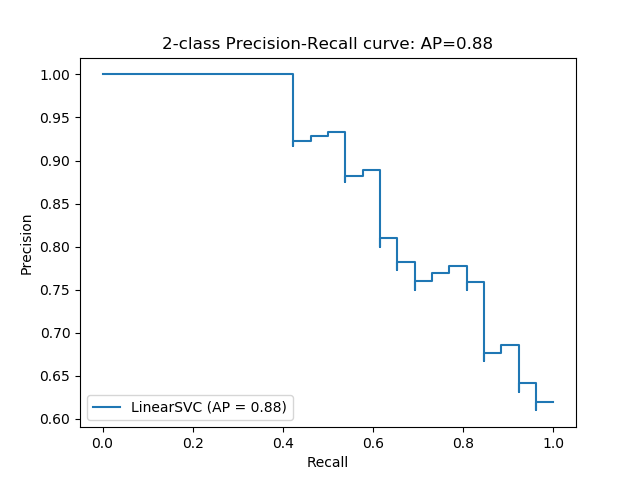
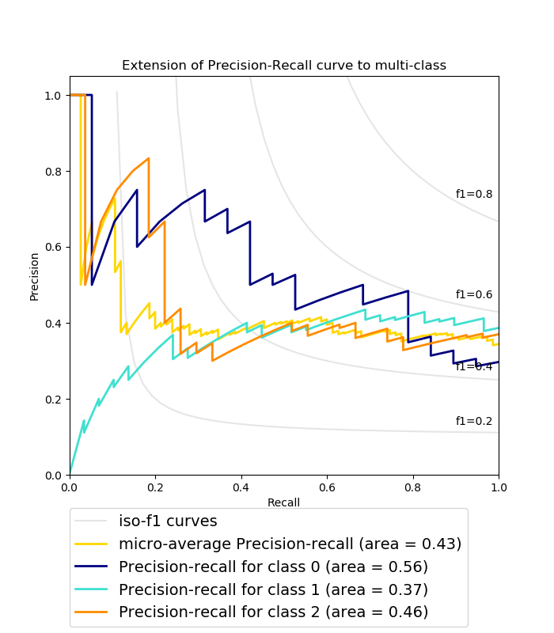

# Precision-Recall Curve

* Precision-recall curve plots precision on the y-axis and recall on the x-axis. It shows the tradeoff between precision and recall at different thresholds.
* It is a useful alternative to the ROC curve when classes are highly ::imbalanced:: since neither precision nor recall takes the true negatives into account.
* Filter the predictions for the testing set by ::positive:: classes. For each sorted prediction probability, set it as the current threshold and calculate precision and recall.

```python
idx = np.argwhere(y_test == 1)[:,0]
pos_score = np.array(sorted(y_score[:,1][idx]))

recall = []; precision = []
for threshold in pos_score:
    y_pred = [int(score >= threshold) for score in y_score[:,1]]
    recall.append(recall_score(y_test, y_pred))
    precision.append(precision_score(y_test, y_pred))

recall = np.array(recall + [0])
precision = np.array(precision + [1])

plt.figure(figsize=(10, 8))
plt.plot(recall, precision, drawstyle="steps-post")
plt.title("Precision-Recall Curve")
plt.show()
```




