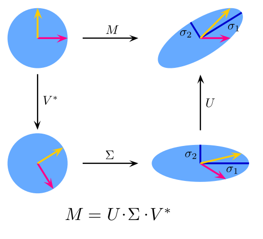

# Principal Component Analysis

* Principal component analysis is a dimensionality reduction technique where each point in the data matrix `X ∈ ℝ^{nxm}` is mapped to its ::orthogonal projection:: onto a lower dimensional subspace, `ℝ^k` where `k<m`, spanned by the top `k` principal components of `X`.
* Principal components are ::mutually uncorrelated:: and ::ordered in explained variance::.
* There are two ways in which the principal components of `X` can be found:
    1. Eigen-decomposition of the covariance matrix of `X`.
    2. Singular value decomposition of `X`.

----

### Eigen-Decomposition of the Covariance Matrix

* ::Variance:: measures the variation of a single random variable, whereas ::covariance:: is a measure of how much two variables vary together.
* `σ(x, y) = (1/n-1)*(i=1 to n)∑(x_i - x̄)*(y_i - y_bar)`.
* With the covariance, we can calculate the entires of the ::covariance matrix::, which is a square matrix given by `C_{i, j} = σ(x_i, x_j)` where `C∈ℝ^{dxd}` and `d` is the number of variables in the data represented by `X∈ℝ^{nxd}`.
* `C = (1/n-1)*(i=1 to n)∑(X_i - X̄)*(X_i - X̄)T`.
    * If `x̄=0`, `C = XXT / (n-1)`.
* Algorithm:
    1. Standardize the data set so that features are on the same scale.
    2. Calculate the m x m covariance matrix `C` of `X`.
    3. Use eigen-decomposition to find the eigenvectors of `C`, i.e., `C = WΛW-1`, where `W` (m x m) is the matrix of eigenvectors, and `Λ ` is a diagonal matrix of `m` eigenvalues, in the following order, `λ_1≥λ_2≥...≥λ_m≥0`.
    4. Transform `X` into `X_k` by multiplying `X` with the top `k` eigenvectors of `C`, i.e., `X_k = XW_k`.

```python
import numpy as np
from sklearn.decomposition import PCA
from sklearn.datasets import load_breast_cancer
from sklearn.preprocessing import StandardScaler

k = 5
X, y = load_breast_cancer(return_X_y=True)
X_sc = StandardScaler().fit_transform(X)

pca = PCA(n_components=k, random_state=229)
X_pca = pca.fit_transform(X_sc)

eig_vals, eig_vecs = np.linalg.eig(np.cov(X_sc, rowvar=False))
X_eig_cov = np.matmul(X_sc, eig_vecs)[:,:k]

print(np.sum(X_pca - X_eig_cov))
```

----

### Singular Value Decomposition (SVD)

* Algorithm:
    1. Standardize the data set so that features are on the same scale.
    2. Use SVD to find `U`, `∑`, and `V` such that `X = U∑VT`.
    3. Calculate `X_k = U_k * ∑_k`, where `U_k` is the top `k` columns of `U`, and `∑_k` is the k x k subset of `∑`.

```python
U, S, V = np.linalg.svd(X_sc, full_matricies=False)
S = np.diag(S)

X_svd = np.matmul(U, S)[:,:k]
print(np.sum(X_pca - X_svd))
```


----

### Scree Plot

* Since principle components are sorted in decreasing explained variance and the eigenvalues represent the magnitude of the eigenvectors, we define the ::explained variance ratio:: of the _j_th principle component as `λ_j / (j=1 to m)∑λ_j`.
* The ::scree plot:: shows the number of principle components on the x-axis and the explained variance ratio of each principle component on the y-axis. Additionally, a cumulative curve can also be plotted.
* Scree plot is used to visually select the optimal number of principal components that captures an acceptable amount of variance without losing too much information and doesn't include too many dimensions, which defeats the purpose of dimensionality reduction.


----

### Biplot

* A biplot shows not only the first two principal components plotted against each other, but also how each variable influence the two components.
* The angle formed between the arrows of any two variables can be interpreted as follows:
    * Acute: positive correlation; the smaller the angle, the stronger the correlation.
    * Right: no correlation.
    * Obtuse: negative correlation;  the bigger the angle, the stronger the correlation.


----

### Resources

* [Understanding the Covariance Matrix](https://datascienceplus.com/understanding-the-covariance-matrix/)
* [Lecture 47 — Singular Value Decomposition | Stanford University](https://www.youtube.com/watch?v=P5mlg91as1c)
* [Principal Component Analysis (PCA)](https://www.youtube.com/watch?v=fkf4IBRSeEc)
* [Principal Component Analysis (PCA) 1 Python](https://www.youtube.com/watch?v=Oi4SJqJIL2E)
* [Principal Component Analysis (PCA) 2 Python](https://www.youtube.com/watch?v=fu7uXxZMzC8)
* [PCA and SVD explained with numpy](https://towardsdatascience.com/pca-and-svd-explained-with-numpy-5d13b0d2a4d8)
