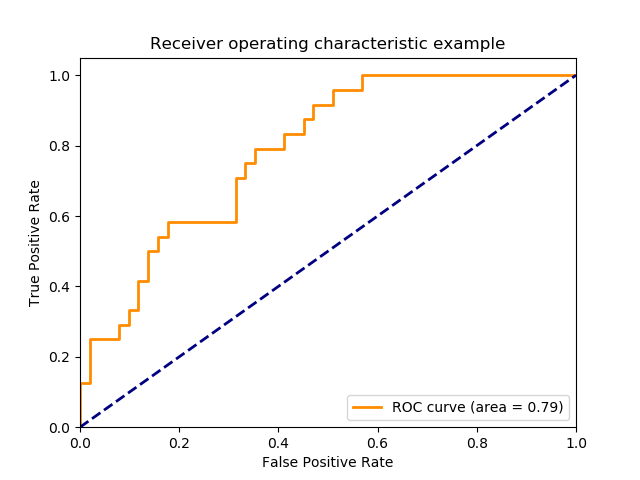
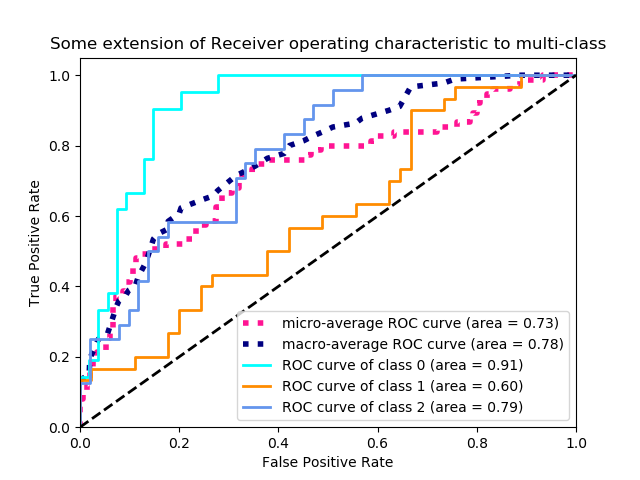

# Receiver Operating Characteristic (ROC) Curve

* A receiver operating characteristic (ROC) curve plots the ::true positive rate (TPR):: on the y-axis and the ::false positive rate (FPR):: on the x-axis.
    * It shows the **tradeoff** between the two.
* For each sorted prediction probability, set it as the current threshold and calculate the TPR and FPR. Once we have two lists of size `len(y_score)`, we can plot the ROC curve.
    * Thus ::each instance of a confusion matrix:: represents a point on the ROC curve.

```python
tpr, fpr = [], []
for score in y_score[:,1]:
	threshold = score
	y_pred = [int(p >= threshold) for p in y_score[:,1]]
  tpr.append(true_positive_rate(y_true, y_pred))
  fpr.append(false_positive_rate(y_true, y_pred))

plt.figure(figsize=(10, 8))
plt.plot(tpr, fpr, label="ROC Curve")
plt.plot([0,1], [0,1], label="Random Guess")
plt.show()
```
* The ::area under the curve:: (AUC) can be interpreted as the **probability** that the classifier will rank a randomly chosen positive instance higher than a randomly chosen negative one.
    * AUC also allows comparison between two or more ROC curves.




