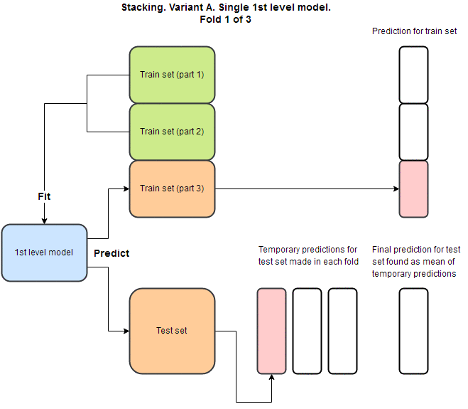
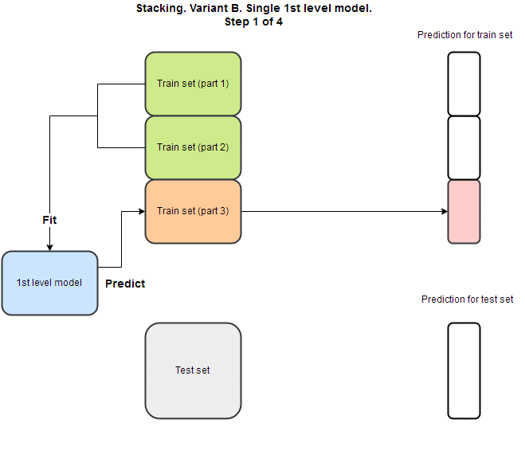

# Stacking

* Stacking is an ensemble learning technique that combines multiple models via a meta-method. The base level models are trained based on a complete training set, then the meta-model is trained on the outputs of the base level model as features.
* Methodology:
    1. Split a training set of size _n_ into _n-1_ slices.
    2. Train a  model on the _n-1_ slices of the data and predict on the last slice.
    3. Repeat step 1 and 2 _n_ times, using a new split each time while concatenating the predictions from each time by row into a size _n_ vector.
    4. Repeat step 1, 2, and 3 for _m_ times, where _m_ is the number of models,; concatenate the vectors from each model into a size _n_ by _m_ matrix.
    5. Use the resulting matrix from step 4 as features to train another "meta" model. This model is the stacking ensemble learner.
* The stacking ensemble method is very similar to deep neural network architectures. In a similar vein, we can stack models as many times as we like.
* The validation set can be generated in a similar way to the training set. See images below.

```python
from vecstack import StackingTransformer

# Get your data

# Initialize 1st level estimators
estimators = [('lr', LinearRegression()),
              ('ridge', Ridge(random_state=0))]
              
# Initialize StackingTransformer
stack = StackingTransformer(estimators, regression=True, verbose=2)

# Fit
stack = stack.fit(X_train, y_train)

# Get your stacked features
S_train = stack.transform(X_train)
S_test = stack.transform(X_test)

# Use 2nd level estimator with stacked features
```
[vecstack](https://github.com/vecxoz/vecstack)



 
