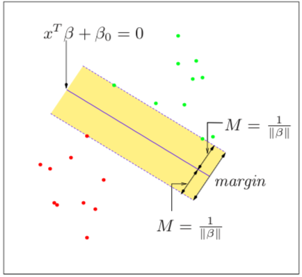
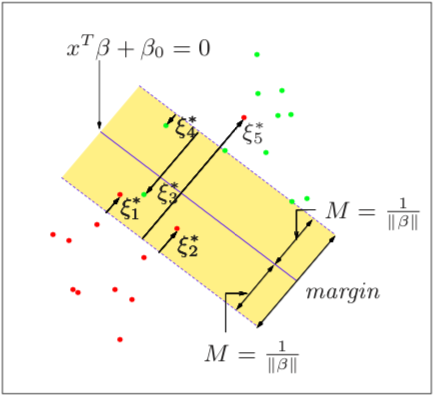

# Support Vector Machine (支持向量机)

* [[Basis Expansion]]
* [[Kernel Trick and Non-Linear SVM]]
* [[Radial Basis Function (RBF)]]

----

### Hard-Margin Linear SVM (硬间隔，线性可分支支持向量机)

* Given `N` pairs of `(x_1, y_1), (x_2, y_2), ..., (x_N, y_n)` where `x_i∈ℝ^p` and `y∈{-1, 1}`, the decision boundary (决策边界) of a linear SVM is a hyperplane (超平面) defined by: `{x: f(x) = (x)Tß + ß_0 = 0`, where `||ß||=1`.
* Thus, a classification rule induced by `f(x)` is `G(x) = sign[(x)Tß + ß_0]`.
* On the figure below, the red and green points that lie on the margins (represented by the dashed lines) are called support vectors (支持向量).
* One way to think of support vectors is to consider them as extreme cases where the two separate classes are the most similar, and hence, are the most difficult to separate, which is why they play a heavier role on deciding where the decision boundary is.
* The optimal hyperplane is one that creates the biggest margin (better generalizability) between the training points for class 1 and -1.
* `(ß,ß_0,||ß||=1)max M` subject to the constraint `y_i * [(x_i)Tß + ß_0]≥M, ∀i`. The inequality means all training examples lie outside the margin.

----

### Soft-Margin SVM (软间隔支持向量机)

* The plot below shows a case where the classes overlap in the feature space. We define slack variables `ξ=(ξ_1, ξ_2,...,ξ_N)` so that the new constraint becomes `y_i * [(x_i)Tß + ß_0]≥M(1-ξ), ∀i`, where `ξ` measures the overlap in relative distance, which changes with the width of the margin `M`.
* `∀i ξ≥0` and misclassification occurs when  `ξ>1`. If we bound `(i=1 to N)∑ξ_i≤K`, we bound the total proportional amount by which predictions fall on the wrong side of their margin.
* Thus, the concept of a linear SVM with soft margin can be expressed as: `(ß_0, ß) min (1/2)||ß||**2+C*(i=1 to N)∑ξ_i` subject to the constraint `ξ_i≥0, y_i * [(x_i)Tß + ß_0]≥1-ξ, ∀i`.
* The cost parameter  `C` is inversely proportional to the size of the margin `M`. Thus, the higher value of `C` , the higher the variance, and vice versa.

