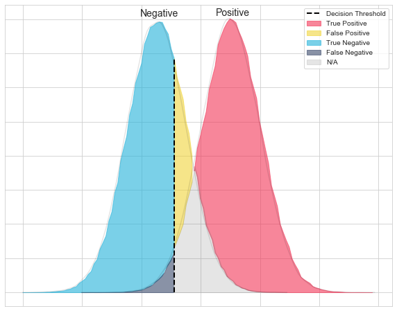

# Type I and II Errors

----

### Type I Error

* Type I error is rejecting a true null hypothesis, i.e., a **false positive**.
    * Status quo: we usually state the null hypothesis as the "negative" event being true, e.g., a patient not having a disease.
* Since `α` is used to determine whether if a statistical test is significant and hence rejecting the null hypothesis, the probability of a type I error is `α`.
* Examples:
    1. In rare disease diagnosis, a type I error corresponds to ::falsely diagnosing:: a person as having the disease.
    2. Under justice systems that adhere to "innocent until proven guilty", a type I error corresponds to ::convicting an innocent:: person.

----

### Type II Error

* Type II error is failing to reject a false null hypothesis, i.e., a **false negative**.
* Examples:
    1. In rare disease diagnosis, a type II error corresponds to ::failing to diagnose:: a person as having the disease. This is a much more serious problem than a type I error.
    2. Under the justice system, a type II error corresponds to ::setting an actual criminal free::.
